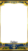

Scripts
=======

## [Download link](https://raw.githubusercontent.com/Cesese/gimp-scripts/master/script.scm)

- Right Click
- Save Link As...

## Installing the scripts

- Find your gimp scripts folder
(for me it was `~/.config/GIMP/2.10/scripts/`.
I also have the `~/.gimp-2.8/scripts/` folder but I guess it's from a previous install because it didn't work)
- Copy/Paste the script.scm file in there.
You can name it however you like, it doesn't matter.


Color Erase
===========

## Introductions

This script takes a picture, a layer, and strips the layer from the base picture.

### Example




## How to use it

### Before running the script

The easiest way is to have 3 folders : one for the bases, one for the layers, and one for the outputs.
You need as many files in each folder and that they're in the same order. The easiest is to have them all have the same name, though you do like you want.

(`/!\`
the script does not create the output files from nothing, you have to create those files before starting it.
Once I know how to do better I'll change it, but for now I just do something like

```bash
$ cd base
$ for f in `ls *`; do touch ../output/$f; done
$ cd ..
```

)

### Running the script

```bash
$ gimp -i -b '(batch-color-erase "base/*" "erase/*" "output/*")' -b '(gimp-quit 0)'
```

`-i`
tells gimp not to open a window (you can't even see the operations going on anyway sadly)

`-b`
tells gimp to use the following script

`batch-color-erase`
is my script

`gimp-quit`
tells gimp to exit once it is over
(because of -i it's hard to see that it's over without this so be careful not to forget it)

Layer On Picture
================

## Introductions

This script takes a picture, a layer, and simply save the picture.

## How to use it

This script is still a wip, as it's only using 1 layer for all the pictures.

### Before running the script

You'll need 2 folders : one for the bases and one for the output.
You will need to have as many files in both folders.
You will also need a layer file.

### Running the script

```bash
$ gimp -i -b '(batch-layer-on-picture "base/*" "layerfile.png" "output/*")' -b '(gimp-quit 0)'
```

Read the Color Erase's section to know what this all means, it's the same.

Further reading
===============

If you want to do some scripting on your own, you should read this https://www.gimp.org/tutorials/Basic_Batch/

And like they say at the end of the tutorial,
> If you want to write your own scripts for batch processing, we suggest you use the Procedure Browser as found in the Help menu. It gives you a detailed list of all commands.
